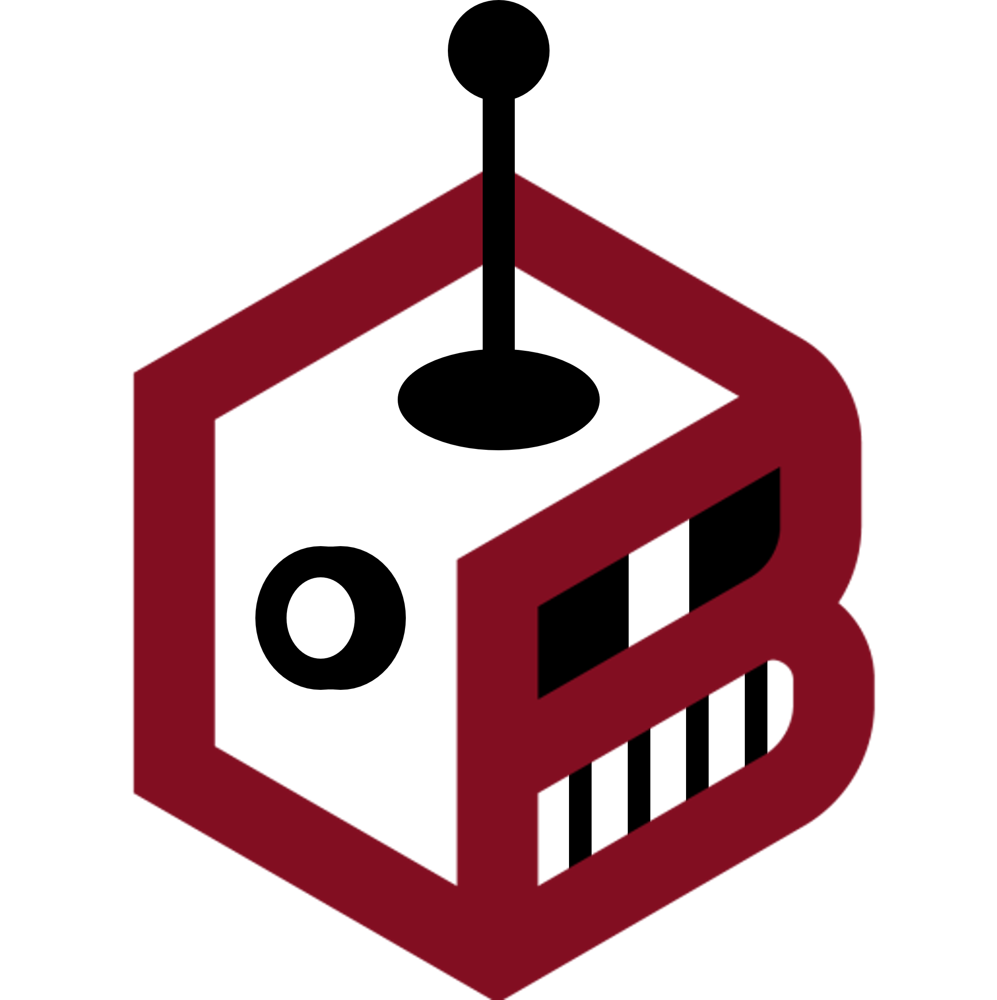

# PBOTS 🤖🎓 - Bot Politechniki Bydgoskiej

[](https://www.python.org/)
[](https://fastapi.tiangolo.com/)
[](https://nextjs.org/)
[](https://qdrant.tech/)
[](https://opensource.org/licenses/MIT)





## ℹ️ O projekcie

PBOTS to zaawansowany bot oparty na sztucznej inteligencji, zaprojektowany dla Politechniki Bydgoskiej. System wykorzystuje technologie RAG (Retrieval-Augmented Generation) aby dostarczać precyzyjnych odpowiedzi na pytania dotyczące uczelni.

### ✨ Główne funkcjonalności

- 🔎 **Inteligentne wyszukiwanie** - przeszukiwanie bazy wiedzy PBŚ
- ⚡ **Streaming odpowiedzi** - wyniki w czasie rzeczywistym
- 🎯 **Filtrowanie tematyczne** - Odpowiada tylko na pytania związane z PBŚ
- 📚 **Szeroka baza wiedzy** - Informacje o studiach, administracji, infrastrukturze
- 💻 **Interfejs webowy** - Przyjazny interfejs czatu dostępny z przeglądarki

## 🚀 Szybki start

### Docker Compose 

```bash
# Klonowanie repozytorium
git clone <repository-url>
cd PBOTS

# Uruchomienie całego systemu
docker-compose up -d

# Sprawdzenie statusu
docker-compose ps
```

👉 Aplikacja będzie dostępna pod adresem: http://localhost:3000


## 💬 Przykłady użycia

Bot odpowiada na różnorodne pytania o Politechnikę Bydgoską. Przykłądy pytań:

### 🎓 Pytania o studia
- "Jakie kierunki studiów oferuje Politechnika Bydgoska?"
- "Ile kosztują studia na PBŚ?"
- "Jakie są wymagania na kierunek Informatyka Stosowana?"
- "Kiedy są zapisy na przedmioty?"

### 🏛️ Pytania administracyjne
- "Jak złożyć wniosek o stypendium socjalne?"
- "Gdzie mogę załatwić legitymację studencką?"
- "Jakie są godziny urzędowania dziekanatu?"
- "Jak przebiega proces rekrutacji?"

### 🏗️ Pytania o infrastrukturę
- "Gdzie znajduje się Wydział Telekomunikacji, Informatyki i Elektrotechniki?"
- "Jakie są godziny otwarcia biblioteki?"
- "Czy jest parking dla studentów?"

## 🖱️ Instrukcja użytkowania
[]

## 🏗️ Architektura systemu

### Komponenty
- **Frontend**: React/Next.js - interfejs użytkownika
- **Backend**: FastAPI - API serwer z logiką biznesową
- **Baza wektorowa**: Qdrant - przechowywanie i wyszukiwanie dokumentów
- **Model AI**: Qwen 3 - generowanie odpowiedzi?

[]


## 🧰 Technologie

### Backend
- **Python 3.11+**
- **FastAPI**
- **Qdrant**
- **Pydantic AI**
- **Logfire**

### Frontend
- **Node.js 18+**
- **Next.js**
- **React**

## 🔧 Konfiguracja

### Zmienne środowiskowe

```bash
# .env
QDRANT_URL=http://qdrant:6333
OLLAMA_URL=http://ollama:11434/v1
LOGFIRE_TOKEN=your_token
ENVIRONMENT=production
```
## 📜 Licencja

Ten projekt jest licencjonowany na warunkach licencji MIT. Zobacz plik [LICENSE](LICENSE) dla szczegółów.

